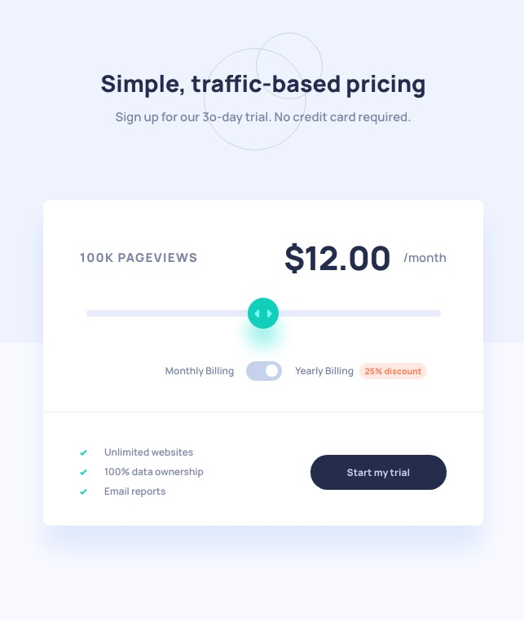

# Frontend Mentor - Interactive pricing component solution

This is a solution to the [Interactive pricing component challenge on Frontend Mentor](https://www.frontendmentor.io/challenges/interactive-pricing-component-t0m8PIyY8). Frontend Mentor challenges help you improve your coding skills by building realistic projects.

## Overview

### The challenge

Users should be able to:

- View the optimal layout for the app depending on their device's screen size
- See hover states for all interactive elements on the page
- Use the slider and toggle to see prices for different page view numbers

### Screenshot

### Links

- Solution URL: https://www.frontendmentor.io/solutions/interactive-price-component-with-vanilla-js-Ftd_G3yGc
- Live Site URL: https://filippo-b.github.io/interactive-price-component/

## My process

### Built with

- Semantic HTML5 markup
- CSS custom properties
- Flexbox

### Useful resources

- [How To - TOggle Switch](https://www.w3schools.com/howto/howto_css_switch.asp) - This helped me for XYZ reason. I really liked this pattern and will use it going forward.
- [AAron Iker toggles](https://codepen.io/aaroniker/pen/ZEYoxEY) - Inspiration for toggle.
- [Update a CSS variable with Javascript](https://css-tricks.com/updating-a-css-variable-with-javascript/)

## Author

- Frontend Mentor - [@Filippo-B](https://www.frontendmentor.io/profile/Filippo-B)
